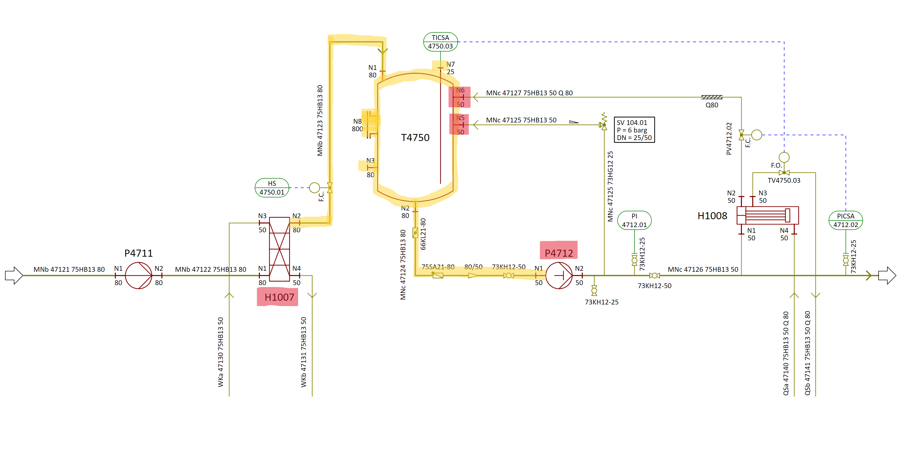
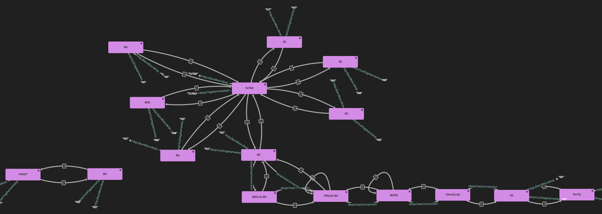

# Boundary / commissioning package example

In this example we will investigate how to find all items along the yellow line. This yellow line represents a comission package given the boundaries highlighted in red. 



### Required input
In order to locate the items inside a boundary the following prerequisites
must be met:
1) At which items the boundary is set
2) We need to know at least one item that exist within the boundary
 
For this example, the boundary is set at the following points:
* Equipment H1007
* Nozzle N6 50 
* Nozzle N5 50 
* Equipment P4712

Equipment T4750 is used as the internal item. The need to know at least one internal item is to differentiate between the outside, and the inside of the boundary. 

## Connecting nodes
P4712 har en Nozzle-7 og en Nozzle-9 
Nozzle-7 har en Node av type Process

PipingNetworkSystem (f.eks. MNc 47124 75HB13 80)
har en eller flere PipingNetworkSegments
som har en eller flere PipingComponent og en Connection

 <Connection FromID="PipeReducer-1" FromNode="2" ToID="Nozzle-7" ToNode="1"/>

## Datalog rules
```
data:insideBoundaryX [?node] :- 
    rdfs:label [?internal, "T4750"],
    dexpi:hasConnection [?internal, ?node],
    dexpi:PipingOrEquipment [?node].
```
This rule defines a starting point of our search by finding items
that is directly connected to our internal object `T4750`. If a node is connected
then it is considered to be inside the boundary as well. 
A node is considered to be `insideBoundaryX` if it meets the following conditions:
1) There exists an internal node with the label `T4750`
2) There is a node that is connected to this internal node 
3) The connected node is of type Piping or of type Equipment

```
data:insideBoundaryX [?node] :- 
    data:insideBoundaryX [?node1],
    dexpi:hasConnection [?node1, ?node],
    dexpi:PipingOrEquipment [?node],
    NOT rdfs:label [?node1, "H1007"],
    NOT FILTER(?node1 = <https://assetid.equinor.com/plantx#Nozzle-12>),
    NOT FILTER(?node1 = <https://assetid.equinor.com/plantx#Nozzle-8>),
    NOT rdfs:label [?node1, "P4712"].
```

The second datalog also defines a condition for a node to be considered inside our boundary. 
Given this rule, a node is considered to be `insideBoundaryX` if the following is true:
1) There exists a node `node1` that is already know is inside our boundary. 
2) There is a connection from `node1` to the node in question 
3) The node in question is of type Pipiing or of type Equipment
4) The connecting node `node1` is not `H1007`, `P4712`, `N6 50` or `N5 50`

This datalog rule is recursive, hence it will continue the search until no new nodes 
satisfy the condition. 

 ## Result
 Running the dexpi.rdfox script loads the dexpi triples generated by rml-mappings into
 and RDFox installation. The datalog rules are also added. 

By running the following query we get PipingCompontents, Nozzles and Equipment inside
the boundary. The datalog rule `insideBoundaryX` is case-specific and made from input from the user. 

 ``` 
 SELECT * 
 WHERE {¨
        ?subject a data:insideBoundaryX .
        ?subject rdfs:label ?label .
        }
 ```

 The query results in the following answer

 

All of the nodes in the result is not connected because the part connecting
nozzle `N2 80` from equipment `H1007` to nozzle `N1 80` on equipment `T4750`
is not of type Nozzle, PipingComponent or Equipment. 

 # Assumptions
- Not sure how boundaries are actually set. 
- Not sure about the criteria for the objects inside a boundary.
    - In this example we have found all nozzles, equipment and piping components
    - What should we actually extract? Tag numbers? 