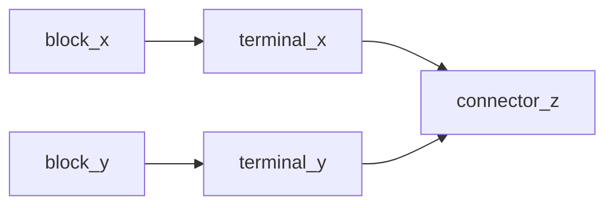

# Overview of mappings
This document describes the RML mappings from proteus XML to IMF RDF contained in this folder.

## Connecting elements in IMF
In IMF a block is connected to a terminal, and a terminal is connected to a connector. 

Given the following triples:
```trig
:block_x imf:hasTerminal :terminal_x . 
:terminal_x imf:hasConnector :connector_z . 

:block_y imf:hasTerminal :terminal_y .
:terminal_y imf:hasConnector :connector_z .
```

This means that `:block_x` and `:block_y` must be connected since their terminals share the same connector:

```trig
:block_x imf:connectedThrough :connector_z .
:block_y imf:connectedThrough :connector_z .

:block_x imf:connectedTo :block_y .
```

Graphical view of this connection:


The mappings from Proteus XML to IMF tries to achieve these connections by mapping the elements to blocks, terminals and connectors.

## Equipment
### [EquipmentBlock.map.ttl](EquipmentBlock.map.ttl)
#### :EquipmentBlockMap
This mapping iterates over all `Equipment` tags and selects the value of the ID attribute as subject. The subject is given the type `dexpi:Equipment` and `imf:Block`. Furthermore, the Nozzle tags contained within an Equipment tag is assigned to be the terminal of the equipment with the predicate `imf:hasTerminal`. 

## PipingComponents

### [PipingComponentBlock.map.ttl](PipingComponentBlock.map.ttl)
#### :PipingComponentBlockMap
This mapping iterates over all `PipingComponent` tags and selects the value of the ID  attribute as subject. The subject is given the type `dexpi:PipingComponent` and `imf:Block`. 
For each subject, two terminals is assigned - one input terminal, and one output terminal. The IRI of the object uses the IRI of the subject concatinated with eiter _input or _output:
- `:PipingComponent-ID imf:hasTerminal :PipingComponent-ID_input .`
- `:PipingComponent-ID imf:hasTerminal :PipingComponent-ID_output .`
Each `PipingComponent` is also a part of the `PipingNetworkSegment` that they are contained in:
- `:PipingComponent-ID imf:partOf :PipingNetworkSegment-ID .`
****
### [PipingComponentTerminal.map.ttl](PipingComponentTerminal.map.ttl)
