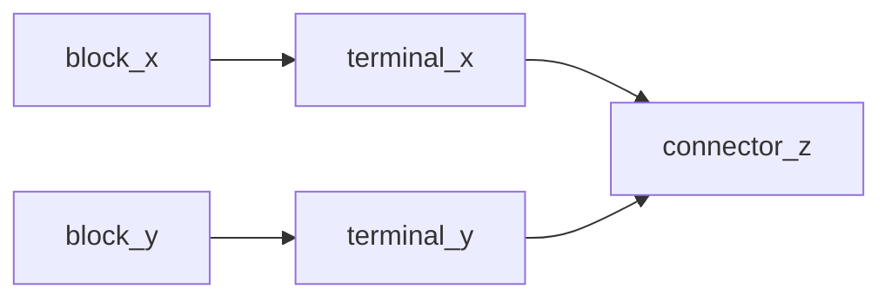

# Overview of mappings
This document describes the RML mappings from proteus XML to IMF RDF contained in this folder.

## Connecting elements in IMF
In IMF a block is connected to a terminal, and a terminal is connected to a connector. 

Given the following triples:
```trig
:block_x imf:hasTerminal :terminal_x . 
:terminal_x imf:hasConnector :connector_z . 

:block_y imf:hasTerminal :terminal_y .
:terminal_y imf:hasConnector :connector_z .
```

This means that `:block_x` and `:block_y` must be connected since their terminals share the same connector:

```trig
:block_x imf:connectedThrough :connector_z .
:block_y imf:connectedThrough :connector_z .

:block_x imf:connectedTo :block_y .
```

Graphical view of this connection:


The mappings from Proteus XML to IMF tries to achieve these connections by mapping the elements to blocks, terminals and connectors.

## Equipment
### [EquipmentBlock.map.ttl](EquipmentBlock.map.ttl)
#### :EquipmentBlockMap
This mapping iterates over all `Equipment` tags and selects the value of the ID attribute as subject. The subject is given the type `dexpi:Equipment` and `imf:Block`. Furthermore, the Nozzle tags contained within an Equipment tag is assigned to be the terminal of the equipment with the predicate `imf:hasTerminal`. 

## PipingComponent

### [PipingComponentBlock.map.ttl](PipingComponentBlock.map.ttl)
#### :PipingComponentBlockMap
This mapping iterates over all `PipingComponent` tags and selects the value of the ID  attribute as subject. The subject is given the type `dexpi:PipingComponent` and `imf:Block`. 
For each subject, two terminals is assigned - one input terminal, and one output terminal. The IRI of the object uses the IRI of the subject concatinated with eiter _input or _output:
- `:PipingComponent-ID imf:hasTerminal :PipingComponent-ID_input .`
- `:PipingComponent-ID imf:hasTerminal :PipingComponent-ID_output .`
- 
Each `PipingComponent` is also a part of the `PipingNetworkSegment` that they are contained in:
- `:PipingComponent-ID imf:partOf :PipingNetworkSegment-ID .`
****
### [PipingComponentTerminal.map.ttl](PipingComponentTerminal.map.ttl)

#### :PipingComponentInputTerminalMap & :PipingComponentOutputTerminalMap
These mappings iterates over all `PipingComponent` tags and selects the value of the ID attribute. This value is concatinated with '_input' or '_output' to create the following subject IRIs :
-  `:PipingComponent-ID_input` which is assigned the type `imf:InputTerminal`.
-  `:PipingComponent-ID_output` which assigned the type `imf:OutputTerminal`.

#### Assigning connectors to the terminals

```xml
<PipingNetworkSegment>
        <PipingComponent ID="PipingComponent-1">
                ...
        </PipingComponent>
         <PipingComponent ID="PipingComponent-2">
                ...
        </PipingComponent>
         <PipingComponent ID="PipingComponent-3">
                ...
        </PipingComponent>
        <Connection FromID="Nozzle-1" FromNode="1" ToID="PipingComponent-3" />
</PipingNetworkSegment>
```
In Proteus XML the `PipingComponents` are arranger in chronological order. Given the XML example above the following triples is created:

```trig
:PipingComponent-1_input imf:hasConnector :Nozzle-1_connector .
:PipingComponent-1_output imf:hasConnector :PipingComponent-1_connector .

:PipingComponent-2_input imf:hasConnector :PipingComponent-1_connector .
:PipingComponent-2_output imf:hasConnector :PipingComponent-2_connector .

:PipingComponent-3_input imf:hasConnector :PipingComponent-2_connector .
:PipingComponent-3_output imf:hasConnector :PipingComponent-3_connector .
```

**The following is true for assigning connectors to input terminals:**

If the `PipingComponent` **is not** the first element then
- Select the ID of the previous piping component and concatinate this value with '_connector' as the object IRI.

If the `PipingComponent` **is** the first element then
- Select the value of `//PipingComponent/Connection/@FromID` and concatinate this value with '_connector' as the object IRI. 

**The following is true for assigning connectors to output terminals:**

If the `PipingComponent` **is not** the last element and there **is not** a `PropertyBreak` on the `PipingNetworkSegment` then
- Select the ID of the current piping component and concatinate this value with '_connector' as the object IRI.

If the `PipingComponent` **is** the last element then
- Select the value of `//PipingComponent/Connection/@ToID` and concatinate this value with '_connector' as the object IRI. 

## PropertyBreak
### [PropertyBreakBlock.map.ttl](PropertyBreak.map.ttl)
#### :PropertyBreakBlockMap 
Follows the same logic as [PipingComponentBlock.map.ttl](PipingComponentBlock.map.ttl), except that we select each `PropertyBreak` tag instead. The subject is also assigned the class `dexpi:PropertyBreak` instead of `dexpi:PipingComponent`.

****
### [PropertyBreakTerminal.map.ttl](PropertyBreakTerminal.map.ttl)
#### :PropertyBreakInputTerminalMap and :PropertyBreakOutputTerminalMap
Sometimes the `PipingNetworkSegment` can start or end in a `PropertyBreak`. If a `P`

```xml
<PipingNetworkSegment>
        <PipingComponent ID="PipingComponent-1">
                ...
        </PipingComponent>
         <PipingComponent ID="PipingComponent-2">
                ...
        </PipingComponent>
         <PropertyBreak ID="PropertyBreak-1">
                ...
        </PropertyBreak>
        <Connection FromID="Nozzle-1" FromNode="1" ToID="PropertyBreak-1" />
</PipingNetworkSegment>
```

Given the xml example above the following triples are created:

```trig
:PipingComponent-1_input imf:hasConnector :Nozzle-1_connector .
:PipingComponent-1_output imf:hasConnector :PipingComponent-1_connector .

:PipingComponent-2_input imf:hasConnector :PipingComponent-1_connector .
:PipingComponent-2_output imf:hasConnector :PipingComponent-2_connector .

:PropertyBreak-1_input imf:hasConnector :PipingComponent-2_connector .
:PropertyBreak-1_output imf:hasConnector :PropertyBreak-1_connector .
```
