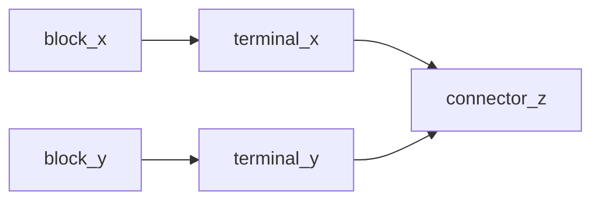
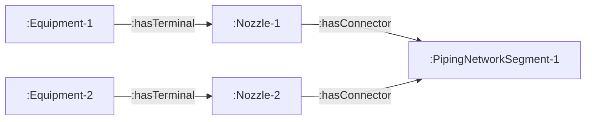
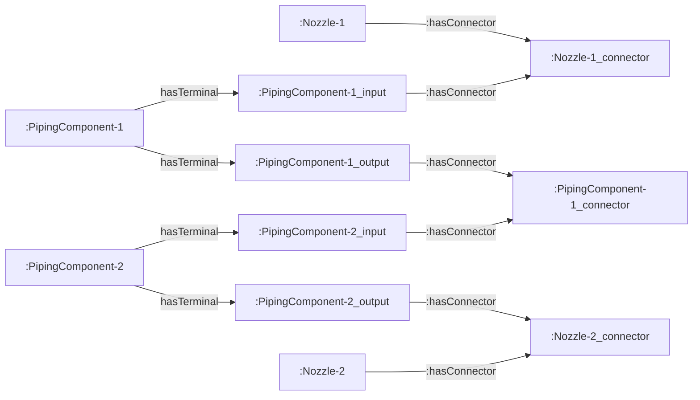
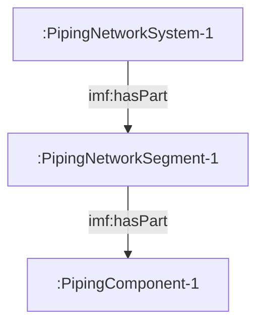

# Overview of mappings
This document describes the RML mappings from proteus XML to IMF RDF contained in this folder.

## Connecting elements in IMF
In IMF a block is connected to a terminal, and a terminal is connected to a connector. 

Given the following triples:
```trig
:block_x imf:hasTerminal :terminal_x . 
:terminal_x imf:hasConnector :connector_z . 

:block_y imf:hasTerminal :terminal_y .
:terminal_y imf:hasConnector :connector_z .
```

This means that `:block_x` and `:block_y` must be connected since their terminals share the same connector:

```trig
:block_x imf:connectedThrough :connector_z .
:block_y imf:connectedThrough :connector_z .

:block_x imf:connectedTo :block_y .
```

Graphical view of this connection:


The mappings from Proteus XML to IMF tries to achieve these connections by mapping some of the tags in Proteus to blocks, terminals and connectors.

## Equipment
### [EquipmentBlock.map.ttl](EquipmentBlock.map.ttl)
#### :EquipmentBlockMap
This mapping iterates over all `Equipment` tags and creates the subject IRI using the value of the ID attribute. The subject is given the type `dexpi:Equipment` and `imf:Block`. Furthermore, the Nozzle tags contained within an Equipment tag is assigned to be the terminal of the equipment with the predicate `imf:hasTerminal`. 

## PipingComponent

### [PipingComponentBlock.map.ttl](PipingComponentBlock.map.ttl)
#### :PipingComponentBlockMap
This mapping iterates over all `PipingComponent` tags and selects the value of the ID  attribute as subject. The subject is given the type `dexpi:PipingComponent` and `imf:Block`. 
For each subject, two terminals is assigned - one input terminal, and one output terminal. The IRI of the object uses the IRI of the subject concatinated with eiter _input or _output:
- `:PipingComponent-ID imf:hasTerminal :PipingComponent-ID_input .`
- `:PipingComponent-ID imf:hasTerminal :PipingComponent-ID_output .`
- 
Each `PipingComponent` is also a part of the `PipingNetworkSegment` that they are contained in:
- `:PipingComponent-ID imf:partOf :PipingNetworkSegment-ID .`
****
### [PipingComponentTerminal.map.ttl](PipingComponentTerminal.map.ttl)

#### :PipingComponentInputTerminalMap & :PipingComponentOutputTerminalMap
These mappings iterates over all `PipingComponent` tags and selects the value of the ID attribute. This value is concatinated with '_input' or '_output' to create the following subject IRIs :
-  `:PipingComponent-ID_input` which is assigned the type `imf:InputTerminal`.
-  `:PipingComponent-ID_output` which assigned the type `imf:OutputTerminal`.

#### Assigning connectors to the terminals

```xml
<PipingNetworkSegment>
        <PipingComponent ID="PipingComponent-1">
                ...
        </PipingComponent>
         <PipingComponent ID="PipingComponent-2">
                ...
        </PipingComponent>
         <PipingComponent ID="PipingComponent-3">
                ...
        </PipingComponent>
        <Connection FromID="Nozzle-1" FromNode="1" ToID="PipingComponent-3" />
</PipingNetworkSegment>
```
In Proteus XML the `PipingComponents` are arranger in chronological order. Given the XML example above the following triples is created:

```trig
:PipingComponent-1_input imf:hasConnector :Nozzle-1_connector .
:PipingComponent-1_output imf:hasConnector :PipingComponent-1_connector .

:PipingComponent-2_input imf:hasConnector :PipingComponent-1_connector .
:PipingComponent-2_output imf:hasConnector :PipingComponent-2_connector .

:PipingComponent-3_input imf:hasConnector :PipingComponent-2_connector .
:PipingComponent-3_output imf:hasConnector :PipingComponent-3_connector .
```

**The following is true for assigning connectors to input terminals:**

If the `PipingComponent` **is not** the first element then
- Select the ID of the previous piping component and concatinate this value with '_connector' as the object IRI.

If the `PipingComponent` **is** the first element then
- Select the value of `//PipingComponent/Connection/@FromID` and concatinate this value with '_connector' as the object IRI. 

**The following is true for assigning connectors to output terminals:**

If the `PipingComponent` **is not** the last element and there **is not** a `PropertyBreak` on the `PipingNetworkSegment` then
- Select the ID of the current piping component and concatinate this value with '_connector' as the object IRI.

If the `PipingComponent` **is** the last element then
- Select the value of `//PipingComponent/Connection/@ToID` and concatinate this value with '_connector' as the object IRI. 

## PropertyBreak
### [PropertyBreakBlock.map.ttl](PropertyBreak.map.ttl)
#### :PropertyBreakBlockMap 
Follows the same logic as [PipingComponentBlock.map.ttl](PipingComponentBlock.map.ttl), except that we select each `PropertyBreak` tag instead. The subject is also assigned the class `dexpi:PropertyBreak` instead of `dexpi:PipingComponent`.

****
### [PropertyBreakTerminal.map.ttl](PropertyBreakTerminal.map.ttl)
#### :PropertyBreakInputTerminalMap and :PropertyBreakOutputTerminalMap
Sometimes the `PipingNetworkSegment` can start or end in a `PropertyBreak`. If a `P`

```xml
<PipingNetworkSegment>
        <PipingComponent ID="PipingComponent-1">
                ...
        </PipingComponent>
         <PipingComponent ID="PipingComponent-2">
                ...
        </PipingComponent>
         <PropertyBreak ID="PropertyBreak-1">
                ...
        </PropertyBreak>
        <Connection FromID="Nozzle-1" FromNode="1" ToID="PropertyBreak-1" />
</PipingNetworkSegment>
```

Given the xml example above the following triples are created:

```trig
:PipingComponent-1_input imf:hasConnector :Nozzle-1_connector .
:PipingComponent-1_output imf:hasConnector :PipingComponent-1_connector .

:PipingComponent-2_input imf:hasConnector :PipingComponent-1_connector .
:PipingComponent-2_output imf:hasConnector :PipingComponent-2_connector .

:PropertyBreak-1_input imf:hasConnector :PipingComponent-2_connector .
:PropertyBreak-1_output imf:hasConnector :PropertyBreak-1_connector .
```

The output terminal IRI is always on the following form `:PropertyBreak-ID_connector`. For the input terminal, however, 
the ID of the last element of the `PipingComponent` is selected - `:PipingComponent-ID_connector`. 

## PipingNetworkSegment 
### [PipingNetworkSegmentConnectionTerminal.map.ttl](PipingNetworkSegmentConnectionTerminal.map.ttl)
#### :PipingComponentSegmentFromNozzleConnectorMap & :PipingComponentSegmentToNozzleConnectorMap

```xml
<Equipment ID="Equipment-1">
        ...
        </Nozzle ID="Nozzle-1">
        ...
</Equipment>
<Equipment ID="Equipment-2">
        ...
        </Nozzle ID="Nozzle-2">
        ...
</Equipment>
<PipingNetworkSegment ID="PipingNetworkSegment-1">
        <PipingComponent ID="PipingComponent-1">
                ...
        </PipingComponent>
         <PipingComponent ID="PipingComponent-2">
                ...
        </PipingComponent>
        <Connection FromID="Nozzle-1" ToID="Nozzle-2" />
</PipingNetworkSegment>
```

The xml example above shows how Proteus XML connects `PipingNetworkSegments` to surronding elements. PipingNetworkSegment-1 starts from Nozzle-1 and ends in Nozzle-2. 
There are two connections that needs to be created:
1) Connecting Equipment-1 and Equipment-2 togehter by PipingNetworkSegment-1
2) Connecting Nozzle-1 to the first element on the `PipingNetworkSegment`, and connecting Nozzle-2 to the last element on the `PipingNetworkSegment`. 

Nozzles are connecting points on equipment, hence they are terminals in IMF. The mappings iterate through each connection point on the `PipingNetworkSegment` that contains the word "Nozzle" and selects the Nozzle-ID as subject IRI. The subject is assigned the class `imf:Terminal` and `dexpi:Nozzle`. The mapping will then assign the correct connector to the 'nozzle-terminals' to ensure that the necessary connections is created. 

#### For connection between piping network segments and equipment


#### For connection to the first and last piping component on the piping network segment

****
#### :PipingComponentSegmentFromConnectorMap & :PipingComponentToConnectorMap
```xml
<PipingNetworkSegment ID="PipingNetworkSegment-1">
        <PipingComponent ID="PipingComponent-1">
                ...
        </PipingComponent>
        <Connection FromID="Nozzle-1" ToID="PropertyBreak-1" />
</PipingNetworkSegment>
<PipingNetworkSegment ID="PipingNetworkSegment-2">
        <PipingComponent ID="PipingComponent-2">
                ...
        </PipingComponent>
        </PropertyBreak ID="PropertyBreak-1">
        <Connection FromID="PropertyBreak-1" ToID="PipeTee-1" />
</PipingNetworkSegment>
```
A `PipingNetworkSegment` does not always start or end in a `Nozzle`, they can also start and end in a `PropertyBreak` or a `PipingComponent`. The property breaks and piping components is already been modeled as `imf:Block`. 
Because of this connecting piping network segments together when they do not end in a nozzle must be handled differently. The `PropertyBreak` and `PipingComponent` elements have been assigned two terminals each, one input and one output terminal. Hence, the following triples for are created given the xml example above:

#### For connection between piping network segments and equipment
```trig
:Nozzle-1 :hasConnector :PipingNetworkSegment-1 .
:PropertyBreak-1_input :hasConnector :PipingNetworkSegment-1 .
:PropertyBreak-2_output :hasConnector :PipingNetworkSegment-2 .
:PipeTee-1_input :hasConnector :PipingNetworkSegment-2 .
```

The mappings for creating a connection to the first and last piping component on the piping network segment when it does not end in a nozzle is already handled by the [PipingComponentTerminal.map.ttl](PipingComponentTerminal.map.ttl). 

## PipingNetworkSystem
### [PipingNetworkSystemConnector.map.ttl](PipingNetworkSegmentConnectionTerminal.map.ttl)
#### :PipingNetworkSystemConnector
This mapping iterates over all `PipingNetwork` tags and selects the value of the ID attribute as subject. The subject is given the type `dexpi:PipingNetworkSystem` and `imf:Connector`. Furthermore, a `PipingNetworkSegment` is a part of the `PipingNetwork`. Resulting in the following triple being created for each `PipingNetworkSegment` contained within a `PipingNetwork`:
-  `:PipingNetworkSystem-ID imf:hasPart :PipingNetworkSegment-ID .`

## Calculating the commissioning package
```datalog
prefix data: <https://assetid.equinor.com/plantx/document/12345#>

data:insideBoundary [?new_node] :- 
    data:insideBoundary [?node] ,
    imf:adjacentTo [?node, ?new_node] ,
    NOT data:boundary [?node] .

data:insideBoundary [?new_node] :- 
    data:insideBoundary [?node],
    imf:hasPart[?new_node, ?node] .
```
The following datalog rule is used to calculate the commissioning package when a boundary is set in NOAKA dexpi mapped to IMF RDF.

A new rule is added to account for the following hierarchy:

Hence, if `:PipingComponent-1` is inside the boundary, then it results in `:PipingNetworkSegment-1` and `:PipingNetworkSystem-1` to be considered as being inside the boundary as well. 

