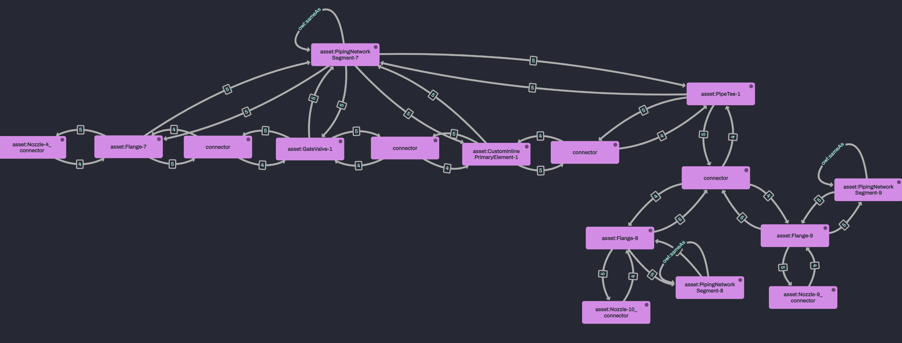
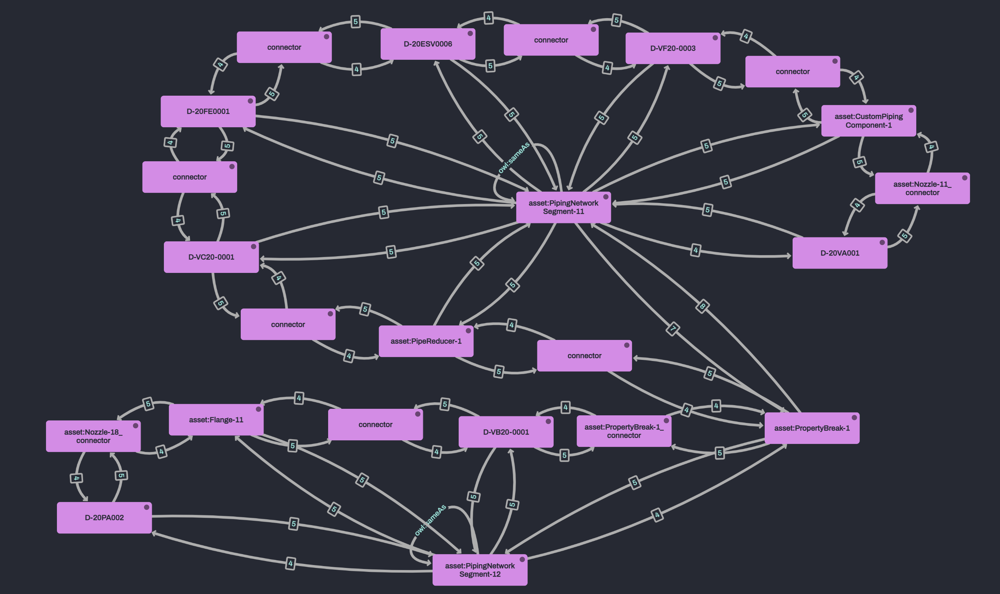

# SPARQL tests 
- These tests are based on the data found in this [document](https://github.com/equinor/NOAKADEXPI/tree/main/Blueprint/DISC_EXAMPLE-02).
- The SPARQL queries without documentation can be found [here](#TODO). 

## Noaka DEXPI to IMF RDF
All dexpi piping components are modeled as blocks in IMF. Each piping component block has two terminals, one input and one output terminal. Each terminal is connected to another terminal with the help of a connector. 

All dexpi equipment are modeled as blocks in IMF. The dexpi nozzles on the equipment is modeled as terminals. A dexpi nozzle is connected to dexpi piping network segments, these piping network segments has been modeled as imf connectors. 

### Connecting piping components to nozzles 
`asset:PipingNetworkSegment-4` connects two equipment blocks togehter;
- `asset:RotaryPump-1` with tag name D-20PA001
- `asset:PlateHeatExchanger-1` with tag name D-20HA001 
- 
`asset:PipingNetworkSegment-4` begins from `dexpi:Nozzle-2` and ends at `asset:Nozzle-3`, hence connecting `asset:RotaryPump-1` to `asset:PlateHeatExhanger-1`. 

The components contained within `asset:PipingNetworkSegment-4` is the piping component blocks `asset:Flange-3` and `asset:Flange-4`. Hence, the input terminal of `asset:Flange-3` should share the same connector as `dexpi:Nozzle-2`, and the output terminal of `asset:Flange-4` should share the same connector as `asset:Nozzle-3` :

```trig
:Flange-3_input imf:hasConnector imf:connector-1 .
dexpi:Nozzle-2 imf:hasConnector imf:connector-1 .
dexpi:Flange-4_output imf:hasConnector imf:connector-2 .
dexpi:Nozzle-3 imf:hasConnector imf:connector-2 . 
```

#### Mapping the first element to a nozzle
Attempting to connect the first piping component within a piping network segment to a nozzle.

```SPARQL
SELECT *
WHERE {
    ?block rdfs:label "D-20PA001" .
    ?block imf:connectedTo* asset:Flange-3 .
    asset:Flange-3 imf:hasTerminal ?componentTerminal .
    ?componentTerminal imf:hasConnector ?connector .
    ?nozzleTerminal imf:hasConnector ?connector .
    ?block imf:connectedThrough ?connector .
}
```

This query should result in the following answer:

| block | componentTerminal | connector | nozzleTerminal |
|-------|----------|-------------------| ---------------|
| asset:RotaryPump-1 | asset:Flange-3_input | asset:Nozzle-2_connector | asset:Nozzle-2 |

When inserting this data into RDFox we get the expected answer.
```SPARQL
INSERT DATA {
                asset:Nozzle-2 imf:hasConnector asset:Nozzle-2_connector . 
                asset:Flange-3_input imf:hasConnector asset:Nozzle-2_connector .
                asset:Flange-3 imf:hasTerminal asset:Flange-3_input .
                asset:Flange-3_input a imf:InputTerminal .
            } 
```
Hence, we need to create these triples in the RML mappings. 

#### Mapping the last element to a nozzle
Attempting to connect the last piping component within a piping network segment to a nozzle.
```SPARQL
SELECT *
WHERE {
    ?block rdfs:label "D-20HA001" .
    ?block imf:connectedTo* asset:Flange-4 .
    asset:Flange-4 imf:hasTerminal ?componentTerminal .
    ?componentTerminal imf:hasConnector ?connector .
    ?nozzleTerminal imf:hasConnector ?connector .
    ?block imf:connectedThrough ?connector .
}
```

This query should result in the following answer:

| block | componentTerminal | connector | nozzleTerminal |
|-------|----------|-------------------| ---------------|
| asset:PlateHeatExchanger-1 | asset:Flange-4_output | asset:Nozzle-3_connector | asset:Nozzle-3 |

When inserting this data into RDFox we get the expected answer
```SPARQL
INSERT DATA {
                asset:Nozzle- imf:hasConnector asset:Nozzle-2_connector . 
                asset:Flange-4_output imf:hasConnector asset:Nozzle-3_connector .
                asset:Flange-4 imf:hasTerminal asset:Flange-4_output .
                asset:Flange-4_output a imf:OutputTerminal .
            }
```
Hence, we need to create these triples in the RML mappings. 

### Connecting piping components from different piping network segments
`asset:PipingNetworkSegment-7`, `asset:PipingNetworkSegment-8` and `asset:PipingNetworkSegment-9` are all connected through `asset:PipeTee-1`:

```xml
<PipingNetworkSegment ID="PipingNetworkSegment-7">
    ...
    <Connection FromID="Nozzle-4" FromNode="1" ToID="PipeTee-1" ToNode="2"/>
</PipingNetworkSegment>
<PipingNetworkSegment ID="PipingNetworkSegment-8">
    ...
    <Connection FromID="PipeTee-1" FromNode="2" ToID="Nozzle-10" ToNode="1"/>
</PipingNetworkSegment>
<PipingNetworkSegment ID="PipingNetworkSegment-9">
    ...
    <Connection FromID="PipeTee-1" FromNode="3" ToID="Nozzle-9" ToNode="1"/>
</PipingNetworkSegment>
```
In order to connect the piping components from these network segments the following connection must be created:
- The last component on `PipingNetworkSegment-7`, `asset:PipeTee-1`, must be connected to the first piping component on `asset:PipingNetworkSegment-8` and `asset:PipingNetworkSegment-9`.

The following SPARQL query verifies this connection:
```SPARQL
SELECT *
WHERE {
  ?block imf:connectedThrough ?connector .
  VALUES ?segment { 
    asset:PipingNetworkSegment-9 
    asset:PipingNetworkSegment-8 
    asset:PipingNetworkSegment-7 
    }
  ?block imf:partOf ?segment .
}
```
The query should result in the following answer:



### Boundary test
The following SPARQL insert sets a boundary and selects an internal component. 

```SPARQL
INSERT DATA {
	asset:PressureVessel-1 a data:insideBoundary . 
	asset:CentrifugalPump-1  a data:boundary .
    asset:Nozzle-13 a data:boundary .
    asset:Nozzle-14 a data:boundary .
    asset:Nozzle-15 a data:boundary .
    asset:Nozzle-16 a data:boundary .
    asset:Nozzle-10 a data:boundary .
    asset:Nozzle-12 a data:boundary .
}
```
The comissioning package generated by this boundary is expected to contain all piping components, equipment and network systems between `asset:PressureVessel-1` and `asset:CentrifugalPump-1`. 

The following Sparql query can be used to verify this:
```SPARQL
SELECT DISTINCT ?node ?label 
WHERE {
    ?node a data:insideBoundary , ?type . 
    OPTIONAL {
        ?node rdfs:label ?label . 
    } 
    VALUES ?type { 
        dexpi:PipingComponent dexpi:Equipment dexpi:PipingNetworkSystem 
    }
}
```
The SPARQL query should result in the following answer:
| node | label | 
|------|-------|
| `asset:BallValve-1`| D-VB20-0001 |
| `asset:PipeReducer-1`| UNDEF |
| `asset:Flange-11`| UNDEF |
| `asset:CustomPipingComponent-1`| UNDEF |
| `asset:CustomOperatedValve-1`| D-20ESV0006 |
| `asset:CustomInlinePrimaryElement-2`| D-20FE0001 |
| `asset:CheckValve-1`| D-VC20-0001|
| `asset:ButterflyValve-1`| D-VF20-0003|
| `asset:CentrifugalPump-1`|D-20PA002 |
| `asset:PressureVessel-1`| D-20VA001 |
| `asset:PipingNetworkSystem-11`| D-20L00004B-1400PL-AS200- |
| `asset:PipingNetworkSystem-10`| D-20L00004A-1400PL-AS200-|

****

The following SPARQL query can also be used to get a better understanding of how the data is connected. 

**NB:** `asset:PipingNetworkSegment-11` is part of `PipingNetworkSystem-10`, and `PipingNetworkSegment-12` is part of `PipingNetworkSystem-11`. 
```
SELECT ?node
WHERE {
    ?node a data:insideBoundary , ?type . 
    ?node imf:connectedTo ?neighbour .
    VALUES ?type { 
        imf:Block imf:Connector 
    }
}
```
It should result in the following graph
